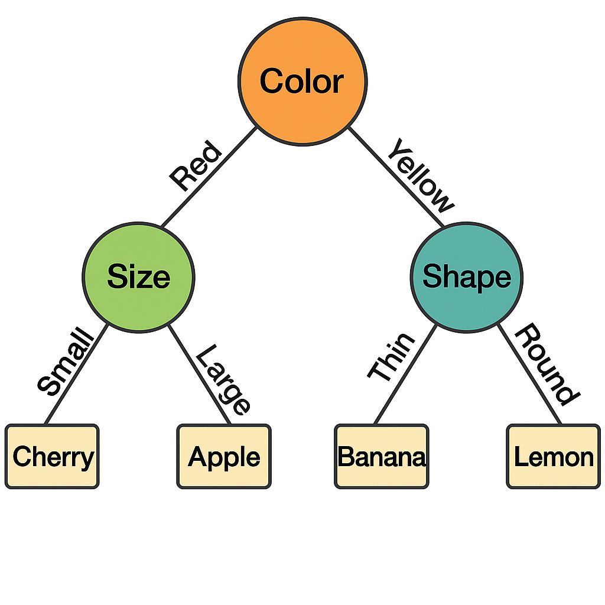
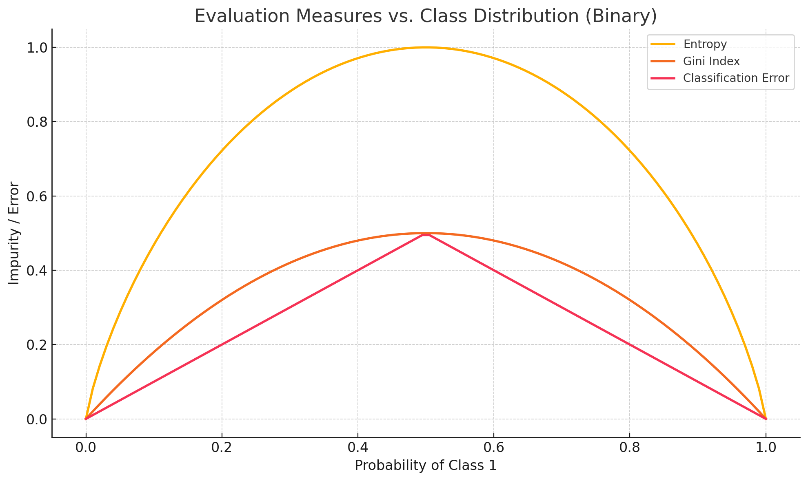
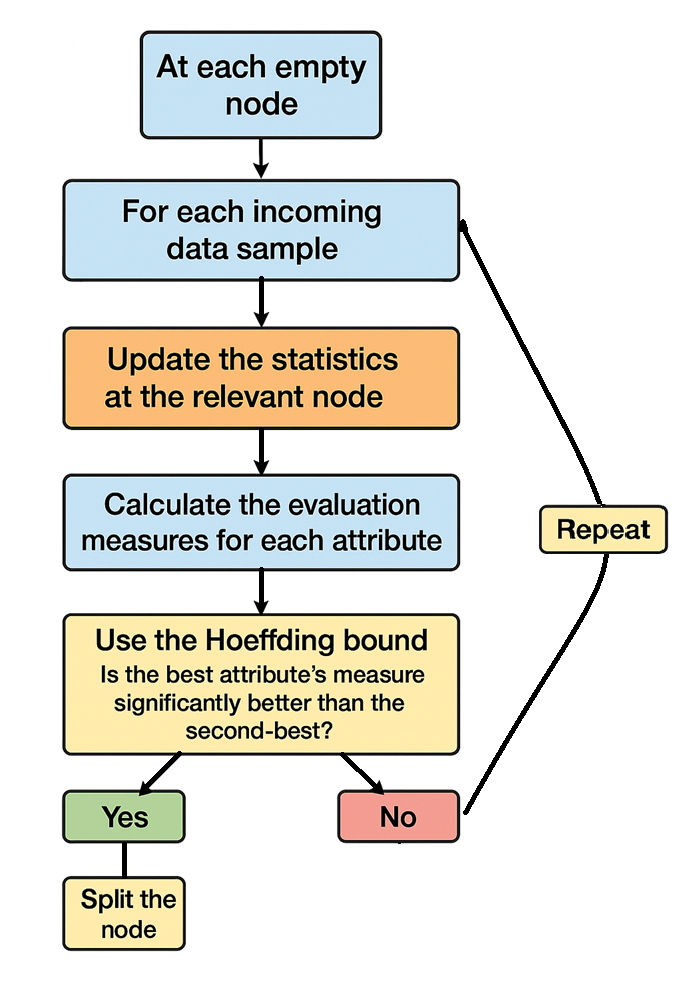

The family of decision tree algorithms is widely used to tackle supervised learning problems. Essentially, it mimics human decision-making by dividing data based on certain criteria, as shown in the illustration below:

Generally, predictions are made more accurate thanks to ensemble methods such as bagging (used in the Random Forest algorithm) or boosting (e.g., XGBoost).

In what follows, we’ll explore how traditional decision trees work and why they struggle with streaming data. Then, we’ll introduce Hoeffding Trees, which address these challenges with a clever use of statistics.

In this article, I'll use the vocabulary linked to decision trees algorithms: 
- **Node**: A point in the tree where data is split based on a condition.
- **Branch**: A path that connects nodes and represents a decision outcome.
- **Leaf**: A node that provides a classification or prediction.
- **Split**: A decision rule that separates the data based on attribute values.

# Why traditional decision trees fail with real-time data

Despite their performance and efficiency, traditional decision trees face certain limitations when deployed in production and confronted with a continuous flow of data:

- **Memory and learning speed**: Decision trees are designed to work with datasets that can be fully loaded into memory. This is not the case with streaming data, which is potentially infinite. As a result, traditional learning approaches are too slow and impractical for real-time applications.
- **Dynamic updates**: Traditional trees lack a mechanism for updating the model incrementally as new data arrives. They require a complete reconstruction of the tree when new data is incorporated, which is computationally expensive and impractical for real-time updates.
- **Data drift management**: In streaming environments, the distribution of underlying data can change over time, a phenomenon known as data drift. Traditional decision trees do not intrinsically adapt to these changes, which can lead to a drop in model accuracy over time.

What I aim to describe in this article is an algorithm, called Hoeffding Tree, that addresses these limitations by using a statistical method to make decisions incrementally without waiting to see all the data. 

# The Math Behind Hoeffding Trees - How They Decide When to Split

## Choosing the Best Split: IG, Gini, and More

To split a node in a decision tree, we need an evaluation measure to define which attribute provides the "best" division for our classification problem. Of course, the notion of "best" here depends on the evaluation measure. Some common measures are:

### Information Gain (IG):

$$
IG(D, A) = Entropy(D) - \sum_{v \in Values(A)} \frac{|D_v|}{|D|} Entropy(D_v)
$$

Where Entropy(D) is the entropy of dataset D, A is an attribute, and Dv is the subset of D for which attribute A has value v.  Entropy is a measure of disorder within a dataset; it's higher when class distribution is more uniform and lower when data is more homogenous (dominated by one class).  

The idea behind information gain is then to quantify how much uncertainty is reduced by knowing the value of an attribute. The second part of the formula represents the weighted average of the uncertainty of the groups formed by splitting on A  (the lower the better) so we want to maximize information gain.

### Gini Index (GI):

$$
Gini(D) = 1 - \sum_{i=1}^{m} p_i^2
$$

$$
GiniGain(D, A) = Gini(D) - \sum_{v \in Values(A)} \frac{|D_v|}{|D|} Gini(D_v)
$$

The Gini index measures impurity in a dataset. A Gini Index value close to 0 suggests that the dataset is homogenous. (The maximum value of impurity depends on the number of classes; it is 0.5 in binary classification.) We want to find the attribute which provides the highest increase in purity.

### Gain ratio:

This measure is used to correct a flaw in Information Gain. Indeed, IG tends to favor attributes with many unique values, like IDs or zip codes, because splitting on those attributes can result in pure subsets (each with one example). Those splits don’t generalize well and lead to overfitting.  

Gain Ratio adjusts Information Gain by considering how "informative" or "uniform" the attribute’s values are.

$$
GainRatio(D, A) = \frac{IG(D, A)}{IV(A)}
$$

Where:

$$
IV(A) = -\sum_{v} \frac{|D_v|}{|D|} \log_2\left(\frac{|D_v|}{|D|}\right)
$$

IV is basically the entropy of the attribute A itself: how spread out the values of A are. If A splits the data into many small, equally-sized parts → high IV, if A splits into a few large parts → low IV. 

### Classification Error

Actually this measure is barely used to grow a tree (rather for pruning, but that's another topic). It measures the misclassification rate at a node: if we always guessed the majority class, how often would we be wrong?

$$
Error(D) = 1 - \max_i(p_i)
$$

Where $$(p_i\)$$ is the proportion of the most frequent class.

### Comparison

The following plot shows how the Entropy, Gini Index, and Classification Error vary as the class distribution changes in a binary classification setting. The x-axis gives the probability of one class (let’s say Class 1), ranging from 0 to 1, while the y-axis is the measure.

All measures peak at p = 0,5 and are 0 at the extremes. Entropy is the most sensitive measure; it penalizes mixed distributions more strongly. Gini tends to behave similarly but less aggressively (but is computationally simpler than entropy). Classification error is the less sensitive of the three.

## How Hoeffding Trees Update in Real Time

For each of the previous measures, we can store statistics allowing us to recompute them quickly.

For Information Gain and Gini Index, as these two measures are based on class probabilities, we can update them simply by tracking the number of instances of each class as they arrive. In practice, at each node, we store two counters: counts[A][v][c] (counter for attribute A, value v and class c) and the total number of samples at the node.

For the Gain Ratio, we also need, for each attribute value, the number of instances that took that value (in order to compute the intrinsic value).

The case of Classification Error is more trivial, as we only need to store a class count vector to identify the most frequent class at each node.

Overall, we recompute the measure every time we evaluate a split, but we don’t touch the raw data anymore. Instead, we use the small counters (like class frequencies per attribute value) we've been updating incrementally, and that greatly reduce the computation time.

## How Many Samples Are Enough? Use the Hoeffding Bound

Imagine you're a judge in a cooking contest, and you’re trying to choose the best soup among many. You can’t drink the whole pot and you are only able to taste a spoonful from each. After a few sips, one soup clearly seems better than the others. But before declaring a winner, you ask yourself: "Am I confident this one is truly better, or could it be luck? Should I taste more?"

It's exactly the same with the Hoeffding Tree algorithm: as we do not have access to the fulldataset, we need to make a decision based on a subset of data and determine the moment we are confident enough to make the decision to split the node.

This is where the Hoeffding bound comes in:

$$
\varepsilon = \sqrt{\frac{R^2 \cdot \ln(1/\delta)}{2n}}
$$

If the difference in evaluation between the best and the second-best attributes is above $$(\varepsilon\)$$, then we can safely split on the best one with probability of at least \(1 - \delta\).

Observing the bound, we can note that:
- As \(n\) (number of samples) increases, the bound shrinks and we become more confident.
- A smaller \(\delta\) (more confidence) makes \(\varepsilon\) larger — we need more data to be sure.
- \(R\) is a normalizing factor: if the scores vary widely, we need more samples to be confident.

Below, we can observe how the bound decreases with the number of sample, for several confidence levels, in the case of a binary classification problem with Gini index as evaluation measure (and therefore R = 0,5)

# The Algorithm and its Variants

## How Hoeffding Trees Work 

Before initializing a Hoeffding Tree, it's important to define a set of key parameters that influence its learning behavior:

- **Maximum Tree Depth**: The maximum number of levels the tree can grow. Controls model complexity and overfitting.
- **Minimum Samples per Node**: Minimum number of samples required at a node before considering a split.
- **Grace Period**: Number of instances a leaf should observe between split attempts. Higher values reduce computation but slow down responsiveness.
- **Split Confidence (δ)**: The confidence level used in the Hoeffding bound to determine when a split is statistically justified (commonly δ = 10⁻⁷).
- **Evaluation Measure**: The metric used to choose the best split (e.g., Information Gain, Gini Index, Gain Ratio).
- **Nominal vs. Numeric Attributes**: Strategy for handling numeric attributes (e.g., using histograms or binary splits).
- **Memory Limit**: Optional constraint to limit the memory usage of the model.

These parameters can be adjusted depending on the trade-offs between accuracy, speed, and computational resources. Then you can run the algorithm summarized in the picture below:

## 4 Variants for Real-World Problems

Several variants of Hoeffding Trees exist to address the specific challenges of learning from data streams, such as evolving distributions, early predictions, and handling continuous targets.

#### 1. Adaptive Hoeffding Trees (AHT)  
*Addresses concept drift, when the underlying data distribution changes over time.*

AHTs improve the original algorithm by integrating drift detection mechanisms (such as ADWIN). They continuously monitor the performance of each branch, and when a decline in accuracy is detected, they can replace outdated subtrees with newly trained ones. This makes the model resilient to evolving data patterns, which may be useful in dynamic environments.

#### 2. Option Hoeffding Trees  
*Addresses attribute ambiguity and limited expressiveness at decision points.*

Option trees allow multiple competing splits to be retained at a node, rather than committing to a single attribute. 
This creates parallel branches that explore different splitting paths, which improves predictive accuracy, particularly in early stages or in cases where multiple attributes appear similarly informative.As is often the case, the trade-off is increased computational and memory cost.

#### 3. Hoeffding Anytime Trees (HATT)  
*Addresses delayed decisions, waiting too long to make useful predictions.*

HATTs are designed to provide reasonable predictions at any moment during training, even before nodes are fully confident or split. This is ideal for time-critical applications where early approximate predictions are better than none. They achieve this by allowing the use of temporary majority-class predictions and revising them as more data arrives.

#### 4. Hoeffding Regression Trees (HRT)  
*Addresses inability to handle continuous target variables.*

While classic Hoeffding Trees are designed for classification, HRTs adapt the same online learning framework for regression tasks. Instead of tracking class counts, they maintain sufficient statistics (e.g., sums, means, variances) to predict continuous outcomes at each node using regression models like linear models or averages.

# Conclusion

Hoeffding Trees show how decision trees can be adapted for the modern world of streaming data. By combining simple statistical principles with clever data structures, they remain fast and effective, even as data keeps flowing in. It's then a reliable foundation for real-time learning. 

