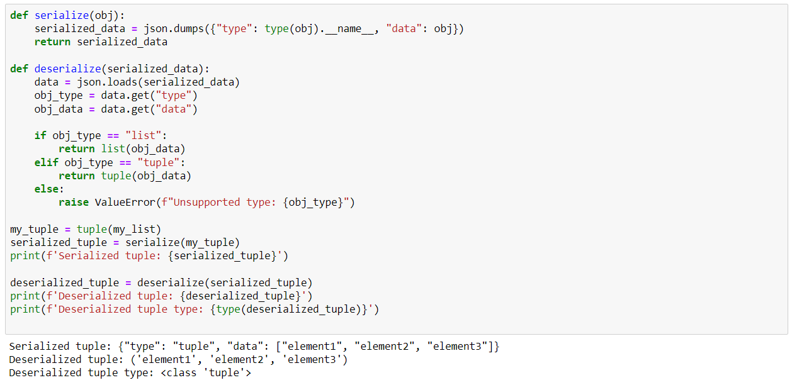
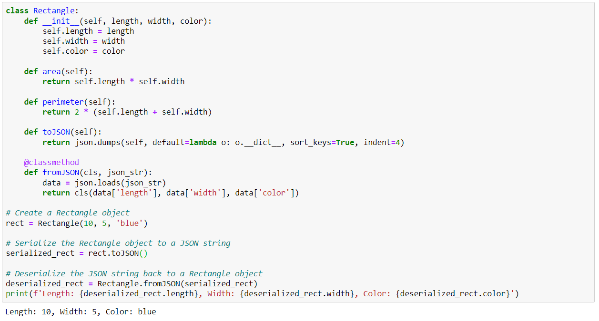
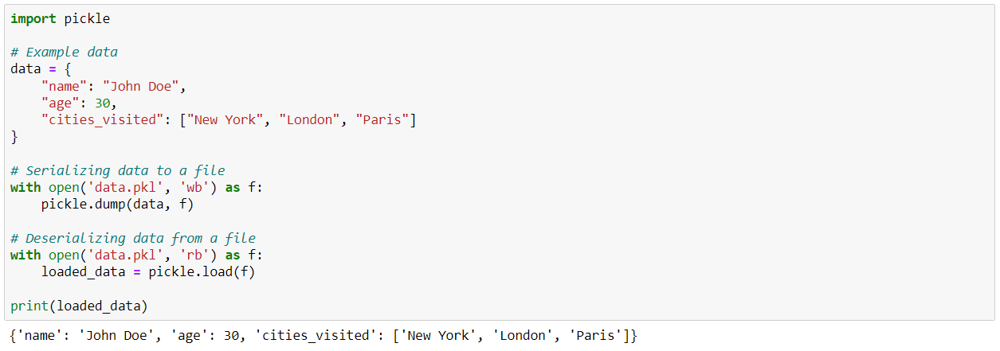
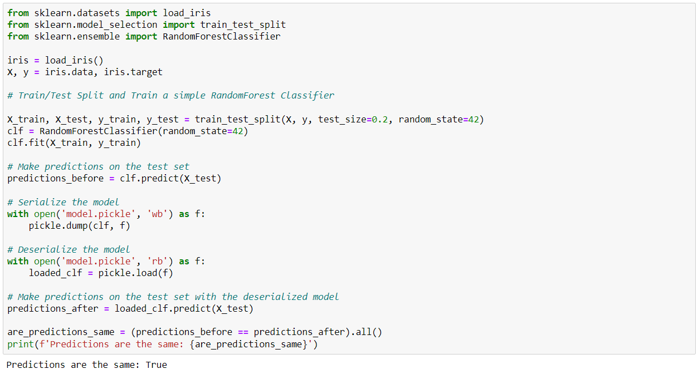
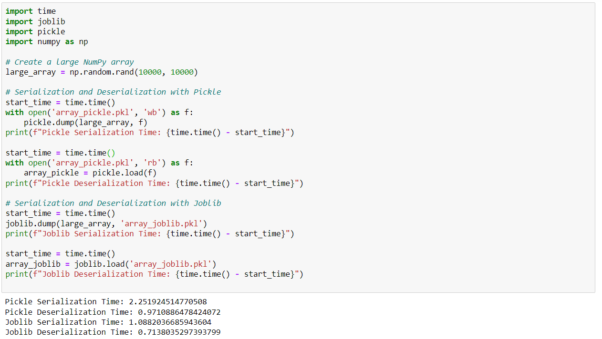

In the [first part](2024-06-15-Decoding-serialisation-challenges-and-stakes.md), we discuss the challenges of serialization and compare a number of serialization formats, based on certain criteria. This second part is devoted to serialization in Python. We'll compare different libraries and look at some interesting best practices.

## A first library: JSON

The json library is widely used to serialize data in Python. It's very simple to use: just import the json module and use its dumps and loads functions.


This type of format, discussed in Part 1, has the advantage of being a human-readable text format. However, it also has a number of limitations, including being heavier than binary formats, and being natively able to store only basic structures. For example, it is not possible to distinguish between lists and tuples: a tuple serialized in Json and then deserialized will be considered a list.


One (albeit fragile) solution is to integrate the object type into the Json file by creating functions for serialization:



Similarly, if you wish to serialize more complex objects such as your own classes and plan to use the Json format for serialization, consider integrating a "toJson" method to serialize and a "FromJson" method to deserialize as you see fit.



Json's drawbacks make it unsuitable for serializing machine learning models. Let's take a look at other libraries more suited to this type of exercise.


## Serializing an ML model

Reading the documentation for various ML frameworks and packages, we can see a certain diversity in the serialization libraries used:

-**PyTorch**'s save and load functions are based on the Pickle library (source).
-**Scikit-learn** recommends using the joblib library, which is better suited to NumPy arrays than Pickle (source)
-**Keras** serializes by default in Hdf5 format (source).


### Pickle

**Pickle** is Python's built-in serialization method, making it suitable for a wide range of uses in this language and, in particular, for serializing a Machine Learning model. It is a Python-specific library. The Pickle module (whose documentation can be found here) therefore requires no installation and provides a direct means of serializing and deserializing using the dump and load functions:



An interesting advantage of Pickle is its ability to serialize customized objects such as the "Rectangle" class we created above.


Beware, however, that Pickle supports different protocol versions. Higher protocol versions can serialize more object types, but may not be readable by older versions of Python.
Here's a final example applied to serializing a Machine Learning model:



To conclude on the Pickle library:

**Advantages**:

1) **Ease of use**: Pickle is simple to use, and several tutorials are available online.
2) **Integrated module**: Pickle requires no additional installation, being directly integrated into Python.
3) **Serialization of custom objects**: Pickle can serialize a very wide range of objects, including user-customized objects.

**Disadvantages**:

1) **Security risk**: Pickle should not be used to deserialize data from unknown sources.
2) **Not human-readable**: The byte stream produced by Pickle is not human-readable, making debugging more difficult.
3) **Python-specific**: Pickle is specific to Python, which may pose interoperability problems with systems implemented in other languages. You also need to ensure compatibility between the Pickle protocol used for serialization and the Python version of the deserialization environment.


## Joblib

**Joblib** is an alternative to pickle, which is not integrated directly into Python (see its documentation here). The choice between these two libraries depends mainly on the type of data. Joblib is known to be faster at saving and loading large NumPy arrays, making it a better choice if your model or data is built on NumPy arrays. This is why the scikit-learn documentation recommends using joblib. On the contrary, Pickle tends to be faster with large collections of Python objects, especially with large collections of small Python objects (e.g., a large dictionary of string objects) due to its C implementation (whereas joblib is implemented in pure Python).

In the example below, we compare the speed of serialization and deserialization of a NumPy matrix in pickle and joblib :




## H5py

**H5py** is a Python library that interfaces with the HDF5 binary format. It is particularly useful for applications that need to efficiently process extremely large datasets (as is often the case in Machine Learning). H5py supports a wide variety of data types (see its documentation here).

An H5df file is characterized by the hierarchical organization of the objects it contains. These can be of two types: groups (which function like Python dictionaries) and datasets (which function like NumPy arrays). Let's see how this library works in practice.

Once you've imported (and installed if necessary) the h5py library, you can open a new h5df file in which you can create groups and datasets using the create_group and create_dataset functions. Groups and datasets can be created within other groups. Data can also be compressed or chunked.


It is then possible to observe the structure of an h5df file using the keys method of Python dictionaries (remember that groups in h5df files are similar to dictionaries and therefore have the same properties).


Last but not least, H5py has the added advantage of being able to call only subsets of serialized datasets, which comes in very handy when dealing with massive amounts of data:


**H5py is probably the best library for serializing machine learning models built with the Tensorflow Keras framework**, thanks in particular to its flexibility with regard to the version of Keras used. This blog post explains how h5py works with TensorFlow.


## Dill

The last library we're going to introduce, more briefly, is dill (see its documentation here). It's a library built on top of the pickle library to extend its functionality. It is not integrated directly into Python and is generally slower than pickle. It does, however, offer a number of new features, including the following:

- *dill.copy*: this function lets you make copies of objects, like Python's copy module, but with support for more object types.
- *dill.check* and dill.pickles: these functions check whether an object can be serialized with pickle. This is particularly useful with custom or complex objects.
- *dill.detect* : this function provides a diagnostic tool for problems related to the serialization of Python objects.
- *dill.pointers* : this function provides a means of extracting pointers (references to other objects) from a Python object. This helps to better understand the structure of an object, particularly in the case of complex or nested objects.

In general, the dill library offers the greatest flexibility in terms of model serialization and should be considered, especially when the pickle or joblib options don't work properly.


## A few best practices

To conclude this introduction to serialization in Python, let's look at a few good practices you can (and should) implement.

The first point is to ensure that your code is **robust and maintainable** by keeping it clean, well-documented and modular. A good starting point, easy to implement, is to create functions designed to serialize and deserialize.

<code> 
```python import pickle
def serialize_data(data, file_path):
with open(file_path, 'wb') as f:
pickle.dump(data, f)

def deserialize_data(file_path):
with open(file_path, 'rb') as f:
return pickle.load(f)

#Usage
data = {'example': 'data'} # Assurez-vous que la variable 'data' est définie
serialize_data(data, 'data.pkl')
deserialized_data = deserialize_data('data.pkl')```
</code>

To facilitate code debugging, be sure to set up an **error handling system**, as in the example below:

<code> 
```try:
    with open('nonexistent_file.pkl', 'rb') as f:
        data = pickle.load(f)
except FileNotFoundError as e:
    print(f"Error: {e}")```
</code>

Having a **versioning** system can also be relevant to data traceability issues. One way of implementing this is to include a version number in serialized data:

<code> 
```data_versioned = {"version": 1, "data": data}

with open('data_versioned.json', 'w') as f:
    json.dump(data_versioned, f)```
</code>

I also advise you to put in place procedures to maximize the **security** of the information you process. This may involve encrypting certain sensitive data, controlling access to data or logging audits (to detect data-related activities). But what you should do at all costs is avoid deserializing data from unknown sources. To ensure data integrity and prevent malicious attacks, you can also set up a data validation system. Certain libraries exist for this purpose, such as jsonschema :

<code> 
```import jsonschema

schema = {
    "type": "object",
    "properties": {
        "name": {"type": "string"},
        "age": {"type": "integer"}
    },
    "required": ["name", "age"]
}
data = {"name": "John", "age": 25}
#Validate data
jsonschema.validate(data, schema)```</code>

Finally, to improve your system's serialization performance, you can favor binary formats over text formats, as we saw in the first article on serialization. In addition, you can look into batch processing, which involves processing data in batches to reduce memory usage, or parallelization, which enables you to run several serialization tasks in parallel to reduce the processing time required.

<code> 
```from joblib import Parallel, delayed

# Assume data_list is a list of data chunks
data_list = [...]

# Parallel serialization
serialized_data_list = Parallel(n_jobs=-1)(
    delayed(pickle.dumps)(data) for data in data_list
)```
</code>

## To Conclude

This introduction to serialization in Python is now complete, and you have an overview of the main serialization libraries for this language. I'll leave you with a few references to help you delve deeper into the subject.

Documentation for the libraries mentioned :

json : [json — Encodage et décodage JSON — Documentation Python 3.12.0](https://docs.python.org/fr/3/library/json.html)
pickle : [pickle — Python object serialization — Python 3.12.0 documentation](https://docs.python.org/3/library/pickle.html)
joblib : [Joblib: running Python functions as pipeline jobs — joblib 1.3.2 documentation](https://joblib.readthedocs.io/en/stable/)
h5py : [HDF5 for Python — h5py 3.10.0 documentation](https://docs.h5py.org/en/stable/)
dill : [Joblib: running Python functions as pipeline jobs — joblib 1.3.2 documentation](https://joblib.readthedocs.io/en/stable/)

Some articles :

[A Gentle Introduction to Serialization for Python - MachineLearningMastery.com](https://machinelearningmastery.com/a-gentle-introduction-to-serialization-for-python/) (especially for the part concerning the use of h5py for Keras).
[What, Why and How of (De)Serialization in Python | by Xiaoxu Gao | Towards Data Science](https://towardsdatascience.com/what-why-and-how-of-de-serialization-in-python-2d4c3b622f6b) : for more information on certain formats not covered here but mentioned in Part 1 (Csv, Avro, XML) or not (BSON).
And the first part of this introduction [here](2024-06-15-Decoding-serialisation-challenges_and_stakes.md)
