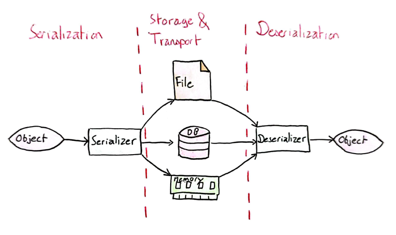
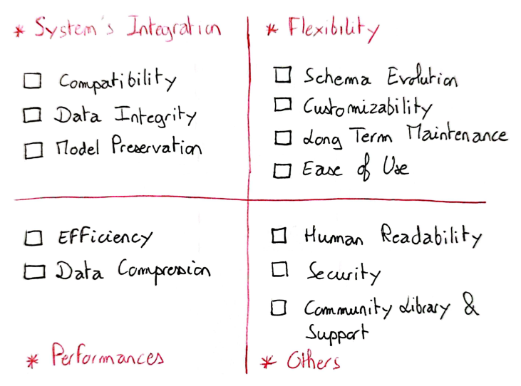
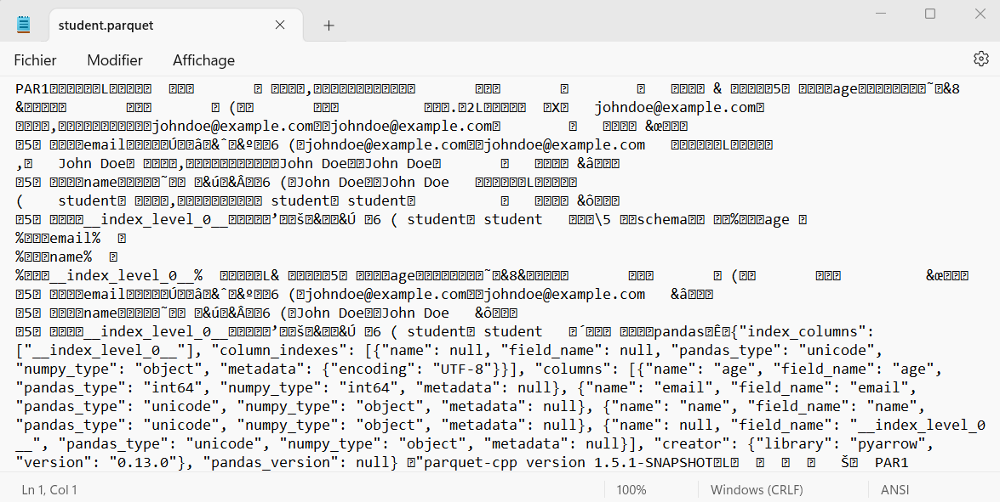
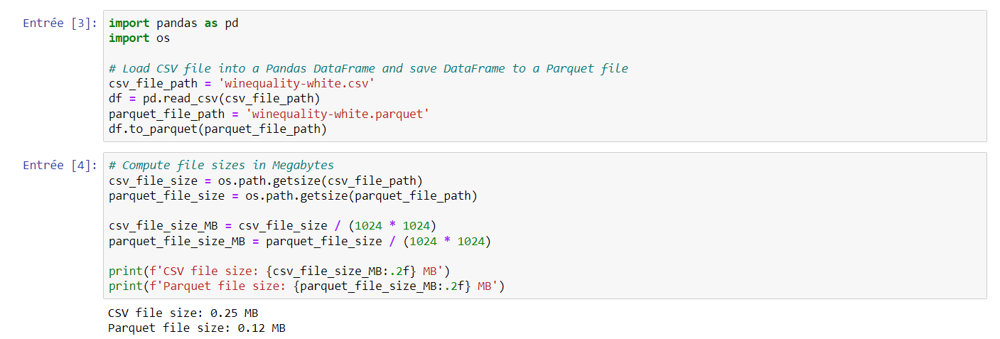

This article is the first part of a series on the serialization process in Machine Learning projects. It deals with serialization issues and formats. [Part 2](decoding-serialization-implementation-with-Python) is devoted to Python implementation.

Serialization is the process of converting an object into a format that can be stored and/or transported. The term object covers a very wide range of elements, more or less complex, such as a data sample, a function or a Machine Learning model.

The reverse process, called **deserialization**, also exists and consists in reconstructing the initial object from its serialized form. By linking the two processes, you avoid having to rebuild the object from scratch as soon as it is needed, which is very useful when you need to deploy a model in production, or when two systems need to communicate with each other (in the latter case, serialization enables objects to be transferred in a structured and predictable way).




The figure above gives a concise overview of the serialization and deserialization processes. To implement them, however, you need to understand the issues involved and ask yourself a number of questions.


## The challenges of serialization

Serialization plays a central role and has a real business impact when developing a Machine Learning system. Depending on the system's needs, different strategies can be implemented, and the choice of serialization format must seek to optimize different criteria. Indeed, serialization has an impact on the following eight areas:

- **Model preservation and deployment**: saves a model for future use and simplifies deployment.
- **Data exchange and communication between different systems**: facilitates data exchange and communication between different parts of a system, or between different systems.
- **Efficient storage and transmission**: reduces the storage space required and the bandwidth used for data transmission, thus saving money, improving performance and optimizing resources.
- **Data consistency and integrity**: guarantees the consistency and integrity of data as it flows through different parts of a system, or between different systems. It permits to maintain data accuracy and reliability.
- **Reproducibility and debugging**: In ML, the ability to reproduce experiments is essential for debugging and improvement. Serialization enables data and models to be stored in such a way that they can be reloaded and used at a later date.
- **Cross-platform compatibility**: provides a standardized means of encoding data, ensuring cross-platform compatibility.
- **Long-term data archiving**: useful when companies often need to archive long-term data for compliance or analysis purposes.
- **Data confidentiality and security**: Serialization can also play a role in data confidentiality and security, by enabling encryption and other security measures applied to serialized data prior to storage or transmission.

By defining the constraints of your project and mastering its environment, you'll be able to choose one serialization method over another. Understanding the impact of serialization will help you determine the criteria for choosing the format best suited to your needs.


## How to choose the right serialization format ?

Before moving on to a comparison of serialization formats, let's take a look at how to evaluate them, since none is inherently better than the others.

Depending on a company's use cases and issues, certain selection criteria become more or less decisive in the choice of serialization method. By way of example, here's a matrix of criteria I used for a past project:




The selection criteria as I had defined them fell into three main categories: **Integration, Flexibility and Performance**. I also added an other category to include the criterion of **human readability**, which was relevant to my project. There is no one format that performs better than the others on all criteria, and the notion of prioritization of  criteria is missing from the list of criteria provided (prioritization depends on the project).

The criteria present in the **Integration** cell are of the highest order: we can even speak of prerequisites. Indeed, the method chosen must be compatible with the system in place, as overall consistency must be preserved. Similarly, the format must ensure the integrity of the objects and preserve their various components.

In terms of **performance**, we're looking to maximize the speed of serialization and deserialization, and minimize the storage space required. The question of speed is all the more crucial when a model has to make predictions in real time. We'll see in Part 2 of this article that, depending on the frameworks used, not all serialization methods for Machine Learning models are equally efficient.

Through the **Flexibility** criteria, I wanted to emphasize the possibility of implementing a personalized methodology that would last over time. This last point seems important to me, given the number of elements that are bound to vary over the lifetime of a company (models, data volumes, infrastructures...). We'll come back to the possibility of rapidly changing file schema in the comparison between formats.

Finally, I had also added a **Human Readability** criterion that was important for my project. Some serialization formats, such as JSON, can be read by humans, which is not the case for binary formats like Parquet. In this "Other" category, I also retrospectively added the security criterion, which is crucial if you're dealing with personal data, and that of the existence of a community, which isn't essential but can prove useful.


## The main serialization formats

A comprehensive comparison of the different types of serialization formats can be found on this [Wikipedia page](https://en.wikipedia.org/wiki/Comparison_of_data-serialization_formats).

### Text vs binary files

Some of the best-known formats are JSON, XML, CSV, Apache Avro, Apache Parquet and Protocol Buffer (protobuf). JSON is probably still the most commonly used serialization format. However, JSON, XML and CSV are at odds with Parquet, Avro and Protobuf: the first group is in text format, while the second is in binary format.

In concrete terms, it is possible for a human to read JSON files:

```
{
                "student": {
                    "name": "John Doe",
                    "age": 21,
                    "email": "johndoe@example.com"
                }
            }
```

But here is the same data in Parquet format, opened with Windows Notepad :



The advantage of the binary format is that it's much more compact, requiring less storage space.



**Text formats gain in simplicity and readability, while losing out in terms of performance**. Parquet, Avro and Protobuf are better suited to huge datasets, or where the speed of serialization or deserialization is important to system performance.

**XML, JSON and CSV are widely supported and easy to use on different platforms and in different languages, making them a good choice for general-purpose serialization and data exchange**. In contrast, Parquet, Avro and Protobuf, while powerful and efficient, may require specific libraries or frameworks, and are therefore better suited to specialized or high-performance environments where the benefits of these formats outweigh the additional complexity. They are also more relevant when the data processed is complex (a CSV format, for example, remains rather limited and is better suited to tabular data with simple data types).


### Schema evolution

Flexibility, especially when it comes to data schema evolution, is a notable distinction between formats such as Parquet, Avro and Protobuf, and traditional text-based formats such as XML, JSON and CSV.

**Textual formats, though widely used, present particular challenges when it comes to adapting data schemas over time**. Let's take a concrete example: suppose you have a system that collects user information via an initial schema comprising name, age and email. If, at some point, a new piece of data (for example, a telephone number) is introduced, the XML, JSON and CSV formats require manual intervention in the code to integrate this new field. This manipulation can become a source of errors, especially in complex environments where schema modifications are commonplace. The consequences can be serious, ranging from data loss to data corruption.

What's more, these formats don't offer native versioning functionality, which is often crucial to maintaining schema consistency across different iterations. Developers then find themselves having to design a bespoke versioning logic, which can be a daunting task.

**In contrast, Protobuf, Avro and Parquet offer a degree of autonomy in managing schema evolution, alleviating the burden of manual work in the event of modifications**. They integrate versioning mechanisms, facilitating the management of various schema versions over time and ensuring that data conforms to the correct schema version. They also offer mechanisms to ensure upward and downward compatibility. A good example of this flexibility is offered by Protobuf, which uses tags to identify fields, enabling fields to be added or removed while maintaining compatibility.

To reinforce the management of schema evolution and versioning, the implementation of a schema registry, such as the one offered by Confluent in association with Apache Kafka and Avro, may prove useful. This registry centralizes schema management by storing them, versioning them and making them accessible as needed, thus harmonizing schema use across all systems. When the schema evolves, the new version is recorded in the registry, enabling the various schema versions to be tracked, and ensuring that the data corresponds to the correct schema. Data producers and consumers interact with the registry to serialize and deserialize data, ensuring compatibility by using the correct schema versions. The registry performs compatibility checks when schemas are registered, ensuring upward and downward compatibility between different schema evolutions. Thanks to this centralized management and version tracking, the schema registry helps minimize errors and improve data integrity, providing a robust solution for navigating the dynamic evolution of data schemas.
Security

XML, JSON and CSV formats do not natively offer security features such as encryption or access control. Security management must be orchestrated at application or system level. Nevertheless, XML is distinguished by a data validation mechanism via XML Schema Definition (XSD), helping to ensure that serialized data respects a given schema, thus guaranteeing a certain level of data integrity. However, XML, JSON and CSV are not free of vulnerabilities, and can be the target of injection attacks if not properly managed. XML External Entity (XXE) attacks illustrate a common security issue associated with the XML format. To enhance the security of data serialized in these formats, additional measures are essential, such as the use of encryption libraries or the transmission of data via secure channels like HTTPS.

On the other hand, binary serialization formats such as Parquet, Avro or Protobuf can be integrated into environments that support encryption. For example, Parquet files can be encrypted within Hadoop environments. These formats can also be used in systems offering data integrity checks, even if this functionality is not intrinsic to the serialization format itself. As with encryption, access control must be managed within the frameworks or systems exploiting these serialization formats, and not at the level of the formats themselves. In secure environments or when transmitted via secure channels, these binary formats can offer a substantial level of security. What's more, their binary nature can reduce the attack surface compared with text formats, which are potentially more vulnerable to injection attacks. A concrete example of this improved security management is offered by Protocol Buffers' field masking function, which enables selective filtering of fields not to be exposed, thus ensuring greater control over data confidentiality.

This distinction between textual and binary security formats underlines the importance of choosing the right serialization format, depending on the security requirements and specific constraints of your project or operating environment.


### Row-Major Versus Column-Major Format

Two predominant formats, embodying two distinct paradigms in the world of data serialization, are CSV and Parquet. The CSV format, which stands for "comma-separated values", adopts a **row-major data model**. This means that successive elements in a row are arranged side by side in memory. Let's imagine a simple table representing student information: each row represents a student, and the columns contain information such as name, age and course of study. In CSV format, all student information is stored together, one after the other.

In contrast, Parquet is a **column-major format**. Here, successive elements of a column are stored side by side in memory. Let's take our student table again. In a Parquet format, all data corresponding to the "name" column will be stored together, followed by all data in the "age" column, and so on.

This distinction is crucial, as modern computers process sequential data more efficiently than non-sequential data. So, if a table is row-major, accessing its rows will be faster than accessing its columns, and vice versa. This means that for row-major formats like CSV, reading data will be faster on a row-by-row basis, while for column-major formats like Parquet, data access will be optimized on a column-by-column basis.

Column-major formats, such as Parquet, are particularly effective for flexible, column-based reading, especially if your data is voluminous, comprising thousands or even millions of elements. For example, if we need to analyze the average age of the students in our table, Parquet would allow us to access and read only the "age" column, without having to go through the whole data set, thus optimizing the performance and speed of our analysis.

> In short, row-oriented formats are more suitable when you need to make a lot of entries, as each new entry is simply added at the end of the file. Column-major formats, on the other hand, perform better when a large number of column-based reads are required, enabling more agile and efficient data analysis.


## To conclude

The main aim of this first part on serialization was to show you the major impact this process has on various areas and features of your system. In this respect, we have seen that the best format does not exist in an absolute sense, but depends strongly on the use case.

The [second part](decoding-serialization-implementation-with-Python) of this article is devoted more specifically to Python serialization and the best practices you can put in place to implement it.
