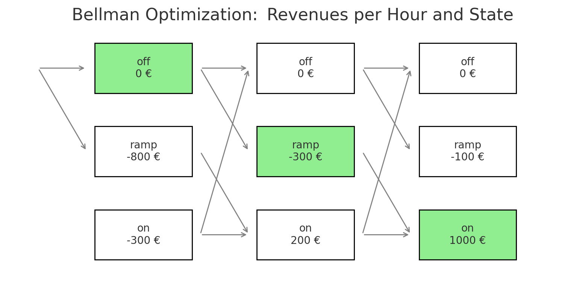

> **Disclaimer**: The theoretical asset used as an example in this article has technical constraints which aim to be        > realistic but are not derived from the technical constraints of an existing asset. The code for the optimization has been > produced from scratch and is available on demand. The market prices have been collected from entso-e transparency platform (for power) and eex website (for gas and CO2).


## Combined-cycle Gas Turbines and Flexibility

Combined-cycle Gas Turbines are flexible power plants, able to quickly start generating and selling electricity. As the name indicates, they use gas as fuel and the combination of two cycles: a gas cycle (combustion turbine) and a steam cycle (with a steam turbine fueled by the heat generated during the first cycle). The flexibility of these power plants should allow them to capture the best prices in the market and to participate efficiently in balancing mechanisms or ancillary services.

However, this flexibility comes with a cost:  
- Ramp-up times that vary depending on the time spent offline (resulting in hot, warm, or cold starts)  
- Significant fixed startup costs as well as variable maintenance costs,  
- Fuel consumption and emissions that strongly depend on the load level and associated efficiency.

If we don't take these costs into account, we're missing a critical part of the problem we're trying to solve here: finding the optimal program for a CCGT. It's not just about starting the plant when Clean Spark Spreads (the price of a MWh of electricity minus the cost of gas and CO₂ required to produce this MWh) are positive, because the additional costs and constraints can quickly turn an apparently profitable startup into an unprofitable one. It is therefore essential to optimize the asset’s operating strategy by accounting for both technical constraints and market signals (electricity, gas, and CO₂ prices).


## Designing our asset

To keep things simple, I model a theoretical CCGT (Combined Cycle Gas Turbine) with a handful of discrete operating states:  
- RAMP_H, RAMP_W, and RAMP_C represent hot, warm, and cold startups, respectively. These are triggered depending on how long the unit has been offline (e.g., hot if it's been off less than 10 hours, warm if less than 40, cold otherwise).  
- Each ramp type has a different time to reach full load: 1 hour for hot, 2 for warm, and 3 for cold.  
- Once the unit is running, it can operate at FULL_LOAD (400 MW at 51% efficiency) or MIN_LOAD (250 MW at 40% efficiency).  
- There's also a STOP state, representing the plant being in the process of shutting down generation  

Below is the plot showing the ramp-up profiles for hot, warm, and cold starts. You can see how the unit reaches full load faster with a hot start, while cold starts take longer and climb more gradually.


On top of that, I’ve defined a few basic constraints:  
- The unit must stay on for at least 4 consecutive hours once started, and off for at least 4 hours after shutdown.  
- Starting the unit costs €2500, plus there’s a variable cost of €0.5 per MWh and a fixed hourly cost of €250  
  applied to operated hours to model maintenance costs.  
- Finally, emissions are included at 0.18 tons of CO₂ per MWh_gas, so CO₂ prices can impact dispatch decisions too.

The focus here isn’t on modeling every physical detail but on creating a simplified structure that captures the essential trade-offs: startup cost vs. expected profit, ramp delays vs. market timing, and efficiency vs. fuel/emission cost.


## What we'll do and not do

Let’s define exactly what we’re doing — and just as importantly, what we’re not doing.

In a real-world setup, plant operators submit bids ahead of time for Day-Ahead markets, often dealing with uncertainty around prices, demand, outages, and other risks. Here, I’m simplifying things a lot: I’ll assume we already know the market prices (electricity, gas, CO₂), and I’ll use those realized prices directly. This lets me focus on one core question:  
**Given a starting state, what’s the most profitable operating plan over the next 24 hours?**

That means:  
- No forecasting or probabilistic price modeling  
- No real-time adjustments or rescheduling based on forecast errors  
- No consideration of capacity markets, balancing services, or ancillary revenues (it could  
  have been interesting to run the plant even under unprofitable Day-Ahead conditions  
  to be able to participate in the balancing mechanism for example)  
- No portfolio effects — we’re looking at a single unit in isolation, not part of an aggregated fleet

The goal is to isolate and explore the logic behind optimal dispatch, under clear operational constraints, using a deterministic and simplified framework.


## How to find the best path: Bellman's algorithm

We could just go through the market prices and decide: start the plant when Clean Spark Spreads are above a certain threshold (fixed prices) and shut it down when they are below.

But, here is the catch: every decision we make now affects what's possible later.

For example, it might actually be smart to start the plant at hour X, even if it's unprofitable, just to keep it warm so that we can benefit from a hot start at hour X + 7 when prices spike.

That's exactly what the Bellman's Algorithm is for: figuring out what’s the best thing to do now, knowing that the future matters.

Let's say we have 3 states: `"on"`, `"off"`, `"ramp"`. We can go from `"off"` to `"ramp"` or stay in `"off"`, from `"ramp"` to `"on"` and from `"on"` to `"off"` or stay in `"on"`. We want to optimize the plant's program for a 3-hour window, starting from `"off"` mode. Instead of planning from the beginning, Bellman says: start at the end and work backwards.

```
1) At hour 4, the world has ended: value is 0 for every state.

2) At hour 3, we compute the revenue for each state:
    "on"   = 1000 €
    "ramp" = -100 €
    "off"  = 0 €
    -> Add max(H+1): always 0

3) At hour 2:
    "on"   = 200 € + max("on": 1000 €, "off": 0)  => 1200 €
    "ramp" = -300 € + max("on": 1000 €)          => 700 €
    "off"  = 0 € + max("ramp": -300 €, "off": 0) => 0 €

4) At hour 1:
    "on"   = -300 € + max("on": 1200 €)          => 900 €
    "ramp" = -800 € + max("on": 1200 €)          => 400 €
    "off"  = 0 € + max("ramp": 700 €, "off": 0)  => 700 €

5) At hour 0 (initial state = off):
    Stay off: 700 €
    Go ramp: 400 €
    => Optimal path: off → ramp → on
```

We can see with this example that it is profitable not to start the plant too early, even if being `"on"` at hour 2 generates more revenue than being in `"ramp"` mode at this hour. The high cost of the `"ramp"` at hour 1 forces us to delay the start.



The algorithm we’ll use in our case follows the exact same logic as the example above, just on a bigger scale. We still work backward, hour by hour, but here’s the twist: in our real setup, the list of possible states is more complex.  We’re not just tracking whether the plant is `"on"` or `"off"`, we also need to keep track of how long it's been off, which affects whether we can do a hot, warm, or cold start.

That’s why our transition table is more detailed: it includes ramp types, hours since shutdown, and additional constraints such as the minimum time `"on"` in case of a start. All of that feeds into Bellman’s logic to make sure we only consider valid transitions, and choose the path that brings the most value in the end.


## Application

To put all this into practice, we run the optimization on a realistic example: **The month of May 2025**, for a CCGT plant located in Belgium.  
- Power prices come from the ENTSO-E Day-Ahead prices for Belgium  
- Gas prices are based on the ZTP hub, sourced from EEX  
- Carbon prices (UKA) also come from EEX

The asset itself has been described earlier with ramp-up delays, startup costs, efficiency curves, and emissions taken into account. The goal is to determine the optimal dispatch strategy hour by hour over the full month, which includes **744 hourly decisions**.

We assume the plant is off for 20 hours when the month begins.


By running this optimization, we can visualize how a theoretically simple dispatch decision is in fact deeply influenced by the technical constraints and path dependencies of the asset. The result: a plant that starts and stops in a way that aligns not just with market prices, but with deeper economic and operational logic. This type of analysis is a valuable tool for plant operators and analysts alike, helping them understand when flexibility creates value, and how to unlock it.

P.S: I first tried to apply the algorithm for a CCGT in France in the same month of May 2025 but the best path was to stay off for the whole month. Indeed, Clean Spark Spreads were not high enough to allow a plant to start: you can check CLean Spark Spreads in France and Belgium in my dashboard -> https://css-calculator.streamlit.app/
